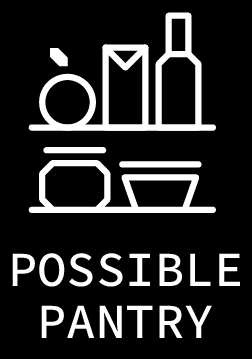

# Welcome to Possible Pantry



**Visit:** https://www.possiblepantry.com/


## Meet the team that made it ```Possible```

### Osita Igwe
**LinkedIn:** https://www.linkedin.com/in/osita-igwe

**GitHub:** https://github.com/oigwe

***
### Erika Perez
**LinkedIn:** https://www.linkedin.com/in/erika-perez-valle

**GitHub:** https://github.com/Eyiperez

***
### Jose Rodriguez
**LinkedIn:** https://www.linkedin.com/in/rodriguez-j

**GitHub:** https://github.com/JayRodrig

***
### Heriberto Uroza
**LinkedIn:** https://www.linkedin.com/in/heriberto-uroza

**GitHub:** https://github.com/heribertouroza

***

## Thank You! :raised_hands: :raised_hands: :raised_hands:

**Aditya Sridhar** - Tech Mentor

**Taq Karim** - Tech Instructor

**Mohammed Mosayed** - Tech Instructor

**Elizabeth Vilchis** - Program Manager

**Monsur Khan** - Program Manager

**Monique Mojica** - Program Manager

**Dessa Shepherd** - Program Manager

**Carlos Martinez** - TA

**Michael Dinnall** - TA

**Susana Han** - TA

**Joyce Ajagbe** - TA

**"And to everyone else that was involved, we thank you for all the support!"**


